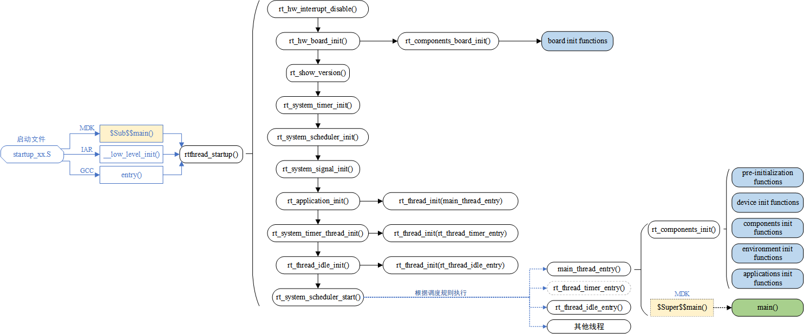
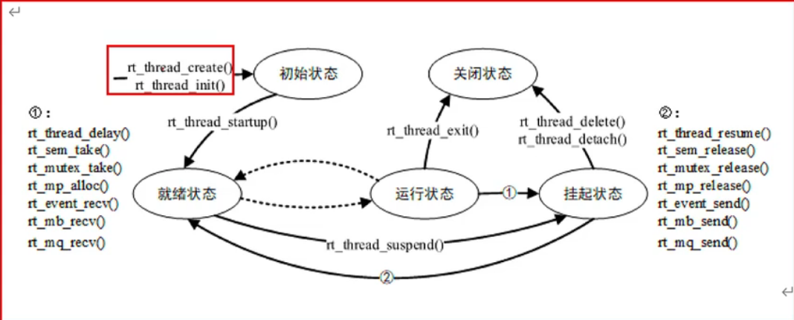

# RT-Thread

## 实时系统

### 概念

实时系统是指在确定的时间内完成规定功能，并能对外部异步事件做出正确响应的计算机系统。

### 分类

分为硬实时系统、软实时系统

### 特性

1. 在不同的系统负载下，行为可以预测
2. 支持基于优先级的调度

#### Linus与RTOS

Linux是一个通用操作系统，其在嵌入式系统中的应用通常包含外设驱动支持、文件系统、网络连接和UI支持。

- 资源消耗大；

- 并不是实时的；

- 所有的Linux的功能都能在RTOS中提供，并能根据需求裁剪。

### 初始化流程

#### 自动初始化

| **初始化顺序** | **宏接口**                | **描述**                                                     |
| -------------- | ------------------------- | :----------------------------------------------------------- |
| 1              | INIT_BOARD_EXPORT(fn)     | 非常早期的初始化，此时调度器还未启动，使用该宏后，fn 将属于 “board init functions”。 |
| 2              | INIT_PREV_EXPORT(fn)      | 主要是用于纯软件的初始化、没有太多依赖的函数，使用该宏后，fn 将属于 “pre-initialization functions”。 |
| 3              | INIT_DEVICE_EXPORT(fn)    | 外设驱动初始化相关，比如网卡设备，使用该宏后，fn 将属于 “device init functions”。 |
| 4              | INIT_COMPONENT_EXPORT(fn) | 组件初始化，比如文件系统或者 LWIP，使用该宏后，fn 将属于 “components init functions”。 |
| 5              | INIT_ENV_EXPORT(fn)       | 系统环境初始化，比如挂载文件系统，使用该宏后，fn 将属于 “enviroment init functions”。 |
| 6              | INIT_APP_EXPORT(fn)       | 应用初始化，比如 GUI 应用，使用该宏后，fn 将属于 “application init functions”。 |

自动初始化所使用的函数，必须是static静态函数。否则会调用失败。

### 时间片

## 一、线程管理

### 是什么

线程调度用来处理多任务同时运行的情况，在硬件资源有限的裸机嵌入式设备中，单核CPU一段时间内只能处理一个事件，导致其他事件被延误，从而使得设备不具有实时性。物联网实时操作系统能够解决这种问题。

#### 系统线程-空闲线程

​		空闲线程是系统创建的**最低优先级**的线程，线程状态**永远为就绪态**。当系统中**无其他就绪态线程**存在时，调度器将调度到空闲线程。它通常是一个**死循环**，且永远**不能被挂起**。
​		空闲线程在 RT-Thread 中有着特殊的用途:

1. 若某线程运行完毕，系统将**自动删除线程**:自动执行 rt_thread_exit()函数，先将该线程从系统就绪队列中删除，再将该线程的状态更改为关闭状态，不再参与系统调度，然后挂入rt_thread_defunct 的僵尸队列（资源未回收、处于关闭状态的线程队列 ）中，最后由空闲线程回收被删除线程的资源。
2. 空闲线程也提供了接口来运行用户设置的**钩子函数**，在空闲线程运行时会调用该钩子函数，适合**钩入功耗管理、看门狗喂狗等工作**。空闲线程必须有得到**执行的机会**，即其他线程不允许一直while(1)死卡，必须调用具有**阻塞性质的函数**;否则例如线程删除、回收等操作将无法得到正确执行。

### 怎么实现

通过多优先级，优先处理某些事件。

#### 线程控制块

由结构体struct rt_thread_t 来表示，用于管理线程，存放一些信息，比如优先级、线程名称、线程状态等。

#### 线程属性

##### 线程栈

##### 线程状态

1. 初始状态：刚开始创建还没开始运行，不参与调度。——RT_THREAD_INIT
2. 就绪状态：按照优先级排队，等待被执行；在当前线程运行完毕就会让出处理器，操作系统会立刻寻找最高优先级的就绪态线程运行。——RT_THREAD_READY
3. 运行状态：线程当前正在运行。——RT_THREAD_RUNNING
4. 挂起状态：可能因为资源不可用挂起等待，或者线程主动延时一段时间而挂起。此时不参与调度。——RT_THREAD_SUSPEND
5. 关闭状态：线程运行结束将处于关闭状态。不参与线程的调度。——RT_THREAD_CLOSE

##### 线程优先级

数值越小的优先级越高。RT_Thread最大32支持个线程优先级。在一些资源比较紧张的系统中，可根据实际情况选择只支持8或32个优先级的系统配置。在Cortex-M系列中普遍采用32个优先级，最低优先级默认分配给空闲线程使用，当有比当前线程优先级更高的线程就绪时，当前线程立刻被换出，高优先级线程抢占处理器运行。

##### 时间片

##### 注意：

作为一个优先级明确的实时系统，如果一个线程中的程序陷入死循环操作，那么比他优先级更低的线程都将不能够得到执行。因此在实时操作系统中必须注意要有让出CPU使用权的动作，如循环中**调用延时函数或者主动挂起（线程进入挂起状态）**。

#### 线程状态之间切换

### 线程相关操作

动态线程与静态线程的区别：动态线程是系统自动从内存堆上分配占空间与线程句柄（初始化堆之后才能使用create创建动态线程），静态线程是由用户分配栈空间与线程句柄。

#### 动态创建

##### 创建线程

调用rt_thread_create函数，并在main函数外编写线程入口函数（要主动挂起或延时来让系统能够进行空闲线程）。这时创建的线程处于RT_THREAD_INIT状态。

###### 线程创建函数要传的tick参数是什么？有什么作用？

当系统中存在相同优先级线程时，这个参数指定线程一次调度能够运行的最大时间长度。

###### 优先级相同的线程，系统怎么执行？

按在main函数中启动线程的顺序来执行，即队列先进先出。

##### 删除线程

注意：系统在线程执行的过程中会自动地释放使用过的内存，不建议在线程中调用删除线程。

##### 启动线程

调用rt_thread_startup函数处于RT_THREAD_READY状态。 

#### 静态创建

##### 创建线程

调用rt_thread_init函数，需要指定栈起始地址。

##### 脱离线程

调用rt_thread_detach函数，将线程对象从线程队列中移除出去。

#### 动态创建和静态创建的区别

实现机制一致，只是内存分配的方式不同。动态创建会在动态堆内存中分配一个线程句柄，而静态创建则是指定栈的大小和指定栈地址。

#### 创建线程需要对创建结果进行验证，并开启线程。

#### 线程辅助函数

##### 获取当前线程

通过函数rt_thread_self函数返回当前正在执行的线程（rt_thread_t类型的结构体指针）

##### 让出处理器资源

通过函数rt_thread_yield让出处理器资源，主动释放cpu的使用权。

##### 线程睡眠

 rt_thread_sleep或rt_thread_delay函数使当前线程进入挂起状态或者睡眠状态。

##### 控制线程函数

rt_thread_control函数通过命令控制线程

##### 设置和删除idle线程hood函数

rt_thread_idle_sethook函数设置线程的钩子函数

##### 设置调度器hook函数

获取在某一时刻发生了什么样的线程切换，通过调用rt_scheduler_sethook函数来设置一个相应的钩子函数，在系统线程切换时，这个钩子函数将被调用。

## 二、时钟管理

OS需要时间来规范其任务。

### 时钟节拍

OS需要提供一个时钟节拍，以供系统处理所有和时间有关的事件，如线程的延时、线程的时间片轮渡以及定时器超时等。

在rtconfig.h文件中定义了时钟节拍的大小

### 获取系统节拍

通过rt_tick_get函数获取当前系统采用的时钟节拍是多少。

### 定时器

是指从指定的时刻开始，经过一定的指定时间后触发一个时间，定时器由硬件定时器和软件定时器之分。

**硬件定时器**：芯片本身提供的定时功能。由外部晶振提供给芯片输入时钟，芯片向软件提供一组配置寄存器，接受控制输入。

**软件定时器**：由操作系统提供的一类系统接口，它构建在硬件定时器基础之上，是系统能够提供不受数目限制的定时器服务。

#### RT_Thread提供两类定时器机制：

1. **单次触发**定时器：在启动后只会触发一次定时器事件，然后定时器自动停止。
2. **周期触发**定时器：这类型定时器会周期性的触发定时器事件，直到用户手动停止，否则将永远执行下去。

在定时器触发后，不能执行线程管理函数（释放或占用内存空间），否则可能会导致原本上下文线程进入睡眠状态。

#### 流程

在RT_THREAD OS启动阶段，执行rtthread_startup函数，在该函数中调用了定时器初始化函数：

1. rt_system_timer_init()定时器系统初始化
2. rt_system_timer_thread_init()定时器线程初始化

#### 工作机制

定时器模块中维护着两个重要的全局变量

- 当前系统经过的tick时间rt_tick（当硬件定时器中断来临时，它将加1）
- 定时器链表rt_timer_list系统新创建并激活的定时器都会按照以超时时间排序的方式插入到rt_timer_list链表中。

#### 相关接口

具体返回参数与传参查看函数定义

1. 动态创建与删除定时器
   1. rt_timer_create
   2. rt_timer_delete
2. 初始化和脱离定时器
   1. 静态创建rt_timer_init（静态创建需要创建一个rt_timer结构体，并在函数的参数中传输此结构体的地址）
   2. 脱离定时器rt_timer_detach
3. 启动与停止定时器
   1. rt_timer_start
   2. rt_timer_stop
4. 控制定时器
   rt_timer_control

### 高精度延时

rt_hw_us_delay微秒延时函数（此函数仅支持低于1个OS tick的延时，否则SysTick会出现溢出而不能够获得指定的延时时间）

## 三、线程间同步

多个执行单元（线程、中断）同时执行临界区（多个执行单元会同时执行到的代码区域，包括软件、硬件资源），操作临界资源，会导致竞态产生，为了解决这种竞态问题，使得在系统运行时只能有一个线程被执行，本操作系统提供了如下几种同步互斥机制：

[^竞态]: **就是在多线程的编程中，你在同一段代码里输入了相同的条件，但是会输出不确定的结果的情况**。“竞态”的发生主要是因为多个线程都对一个共享变量有读取-修改的操作。在某个线程读取共享变量之后，进行相关操作的时候，别的线程把这个变量给改了，从而导致结果出现了错误。

- 信号量
- 互斥量
- 事件集

### 信号量

是一种轻型的用于解决线程间同步问题的内核对象，线程可以获取或释放它，从而达到**同步**或**互斥**的目的。

每个信号量对象都有一个信号量值和一个线程等待队列，信号量的值对应了信号量的实例数目、资源数目。当信号量实例数目为零时，再申请该信号量的线程就会被挂起在该信号量的等待队列上，等待可用的信号量实例。

#### 信号量结构体

rt_semaphore，也为rt_sem_t

#### 信号量的使用和管理

##### 创建/初始化信号量

- 动态创建：rt_sem_create
- 静态创建：rt_sem_init

##### 使用信号量

1. 获取信号量：rt_sem_take
   当信号量大于0时，线程才能获取到信号量资源。获取成功后，对应信号量会减1。如果信号量等于0，则当前信号量资源不可获取，申请该信号量资源的线程将会根据time参数来选择直接返回、挂起等待一段时间，或者永久等待，直到该信号量的其他线程或中断释放该信号量。
2. 释放信号量：

##### 释放信号量

rt_sem_release

线程不再使用临界区时，要释放占用的信号量。释放信号量可以唤醒挂起在该信号量上的线程。

尽管信号量在创建时制定了最大可获取数量，但是多次使用此函数也会导致超出设置的最大可获取数量

##### 删除/脱离信号量。

rt_sem_delete

如果删除该信号量时，有线程正在等待该信号量，那么删除操作会下唤醒等待在该信号量上的线程（等待线程返回值是-RT_ERROR），然后再释放信号量的内存资源。

### 互斥量

体现的是排他性。类似于二值信号量。但是信号量可由不同的线程释放， 互斥量只能由同一线程进行释放。

#### 互斥量的使用和管理

##### 创建互斥量

rt_mutex_create/init

##### 获取互斥量

rt_mutex_take

##### 释放互斥量

rt_mutex_release

##### 删除互斥量

rt_mutex_delete

### 事件集

一个事件集可以包含多个事件，利用事件集可以完成一对多，多对多的线程间同步。

#### 一个线程和多个事件的关系：

其中任意一个事件唤醒线程，或几个事件都到达后唤醒线程，多个事件集合可以用一个uint32_t整型变量来表示。变量的每一位代表一个事件，线程通过“逻辑与”或“逻辑或”将一个或多个事件关联起来，形成事件组合。

#### RT_Thread定义的事件集有以下特点：

- 事件只与线程相关，事件间相互独立
- 事件仅用于同步，不提供数据传输功能
- 事件无排队性，即多次向线程发送同一事件(如果线程还未来得及读走)，其效果等同于只发送一次

#### 管理方法

事件集变量名为rt_event_t

##### 创建

rt_event_create

##### 发送

rt_event_send

##### 接收

rt_event_recv

##### 删除/脱离

rt_event_delete/detach

## 四、IO设备模型

IO设备模型框架位于硬件和应用程序之间，共分为三层，从上到下分别是IO设备管理层、设备驱动框架层、设备驱动层。

应用程序通过IO设备管理器提供的接口来使用硬件，在IO设备管理器中驱动硬件。

#### IO设备类型

#### 创建和注册IO设备

##### 创建

驱动层负责创建设备实例（结构体），并注册导IO设备管理器中。rt_device_create

##### 销毁

动态创建的设备不再需要使用时可通过rt_device_destroy来销毁

##### 注销

设备注销不会释放设备控制块占用的内存

##### 访问硬件

re_device_ops结构体的操作方法集中提供了标准的访问接口，比如初始化、打开、关闭、读写、控制等接口。

##### 注册

普通设备可通过rt_device_register来注册。对于已经具有相应驱动框架的复杂设备，比如看门口定时器，可通过rt_hw_watchdog_register来注册

#### 访问IO设备

## 五、UART串口设备

### 访问串口设备接口

通过rt_thread接口来对USART串口设备进行访问。

rt_device_find()函数来查找uart设备

### 串口控制

rt_device_control()函数来对串口参数进行配置。

## 六、ADC设备

模数转换器，将连续变化的模拟信号转换为离散的数字信号的器件。

### 相关参数

#### 分辨率

分辨率用二进制或十进制数的位数来表示，说明了模数转换器对输入信号的分辨能力，位数越多，分辨率越高，回复模拟信号时会更精确。

#### 精度

在所有数值点上对应的模拟值和真实值之间的最大误差值，也就是输出数值偏离线性最大的距离。

#### 转换速率

A/D转换器完成一次葱末你到数字的AD转换所需时间的倒数。

### 访问ADC设备

定义rt_adc_device_t结构体作为adc句柄

使用rt_device_find()查找ADC设备

#### 启动adc设备

rt_adc_enable()

## 七、I2C设备

半双工、双向二线制同步串行总线。

传输数据时只需要两根信号线：

1. 双线数据线SDA
2. 双向时钟线CLK

### 访问I2C设备

#### 查找I2C设备

rtt_device_find

#### 数据传输

rt_i2c_transfer
